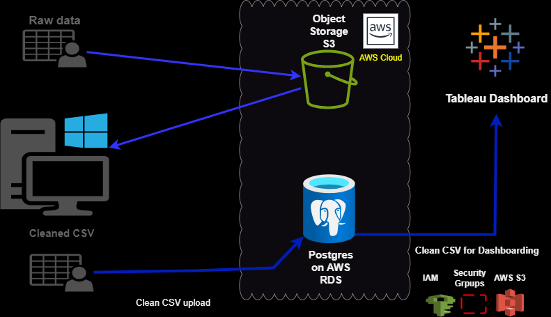
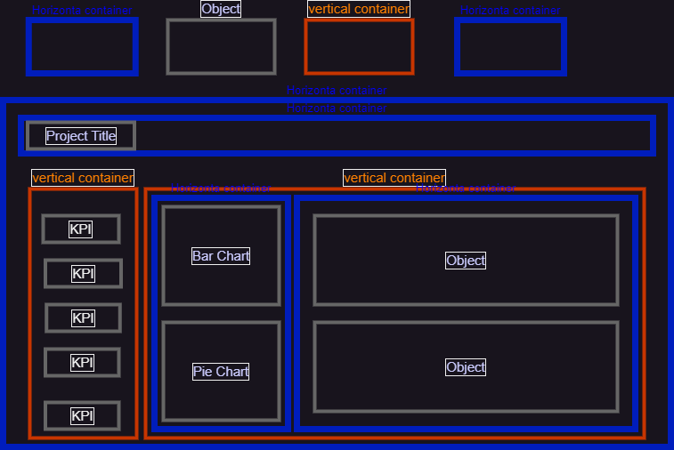
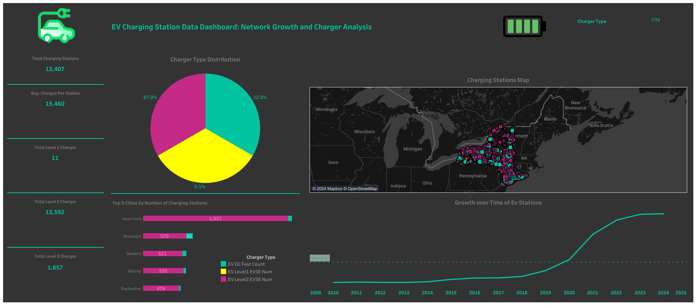

# EV Charging Station Data Engineering Project

## Table of Contents
1. [Business Objective](#business-objective)
2. [Data Sources](#data-sources)
3. [Tech Stack](#tech-stack)
4. [Project Architecture](#project-architecture)
5. [Key Performance Indicators (KPIs)](#key-performance-indicators)
6. [Installation and Setup](#installation-and-setup)
7. [Usage](#usage)
8. [Visualization](#visualization)
9. [Future Enhancements](#future-enhancements)


## **Problem Statement**

The growing adoption of Electric Vehicles (EVs) has increased the demand for a reliable and well-distributed network of EV charging stations. However, many charging network operators and stakeholders face challenges in managing and optimizing their infrastructure. Key issues include:

1. **Operational Reliability**: Ensuring that charging stations are consistently operational and minimizing downtime due to maintenance issues or technical faults.
2. **Accessibility**: Providing sufficient 24/7 accessible stations to meet the needs of all users, especially during off-peak hours or in high-traffic areas.
3. **Data Accuracy**: Keeping information about station status, availability, and connector types up to date, as outdated data can lead to poor user experiences and lower usage rates.
4. **Infrastructure Gaps**: Identifying areas with insufficient coverage of fast chargers or public stations, which can limit the network’s growth and user satisfaction.
5. **Scalability**: Managing the rapid growth of charging infrastructure while maintaining high performance and availability, especially as new stations are added.

This project addresses these challenges by building an automated, scalable data pipeline that ingests, processes, and analyzes EV charging station data. The solution provides key performance indicators (KPIs) and visual insights that help stakeholders monitor station performance, optimize infrastructure, and make data-driven decisions to improve user experience and support network expansion.

---

## Business Objective
*As the demand for Electric Vehicles (EVs) continues to rise, the availability and accessibility of reliable EV charging infrastructure are critical for both EV owners and charging network operators. This project aims to create a comprehensive data pipeline and analysis solution that provides valuable insights into the performance, accessibility, and growth of EV charging stations. By leveraging Python, AWS, SQL, and Tableau, we build an automated, scalable system that enables stakeholders to monitor charging station operations, optimize infrastructure, and make data-driven decisions to enhance the user experience.*

## Data Sources
- **EV Charging Data**: CSV file with details on charging station locations, status, availability, and types of connectors.

## Tech Stack
- **Python**: Data ingestion, processing, and transformation.
- **AWS S3**: Storage for raw data files.
- **AWS RDS (PostgreSQL)**: Relational database for structured data storage.
- **SQL**: Data analysis and KPI calculations.
- **Tableau**: Visualization and dashboard creation.
- **AWS Lambda**: Automation of data ingestion and updates. (optional)

## Project Architecture


The Electric Vehicle (EV) Charging Station Data Engineering Project is designed to process and analyze data from EV charging stations across the United States. The project pipeline involves several key stages, leveraging AWS cloud services, Python for data processing, PostgreSQL for data storage, and Tableau for visualization.
Below is a detailed description of each step in the pipeline:

### 1. Data Ingestion

- The project begins with raw data in the form of a CSV file containing information about EV charging stations (e.g., station name, address, charger types, and geolocation data).
- The raw CSV data is initially stored locally and then uploaded to an AWS S3 bucket for secure cloud storage and backup.

### 2. Data Cleaning and Transformation (ETL)

- A Python script performs the Extract, Transform, Load (ETL) process:
  - **Extract**: The raw data is read from the CSV file.
  - **Transform**: The data undergoes cleaning, including handling missing values, converting data types (e.g., date columns), and standardizing text columns. The cleaned data is prepared for analysis.
  - **Load**: The transformed data is uploaded to an AWS RDS instance using PostgreSQL for efficient querying and storage.

### 3. Data Storage in AWS RDS (PostgreSQL)

- The cleaned data is stored in a PostgreSQL database hosted on AWS RDS. This allows for scalable, reliable, and secure data storage.
- The database schema is designed to accommodate various attributes of EV charging stations, including geolocation, charger types, and operational status.

### 4. Data Querying and Analysis

- The data in AWS RDS can be queried using Python with the `psycopg2` library. The queries are used to extract insights and calculate key performance indicators (KPIs), such as:
  - Total number of charging stations
  - Distribution of charger types (Level 1, Level 2, DC Fast)
  - Top 5 cities and states with the most charging stations
  - Average number of chargers per station

### 5. Data Export for Visualization

- The finalized cleaned data is exported as a CSV file for visualization purposes.
- This CSV file is then imported into Tableau Public, where it is used to create a comprehensive dashboard.

### 6. Dashboard and KPI Visualization (Tableau)

- The Tableau dashboard provides an interactive view of the EV charging station data, showcasing key KPIs and insights.
- The dashboard includes the following visualizations:
  - **Map Visualization**: Geographical distribution of charging stations using latitude and longitude.
  - **Charger Type Distribution**: Pie chart showing the percentage of Level 1, Level 2, and DC Fast chargers.
  - **Top Cities and States**: Bar charts highlighting the regions with the most charging stations.
  - **Average Chargers per Station**: Key metrics displayed using KPI indicators.

### 7. Deployment and Access

- The pipeline is designed for local development and cloud deployment. The Python scripts handle data ingestion, cleaning, and loading to AWS RDS.
- The Tableau dashboard can be shared publicly on Tableau Public for easy access and presentation.

## Key Performance Indicators (KPIs)(Optional)
- **Station Operational Rate**: Percentage of stations that are operational.
- **Fast Charging Availability**: Ratio of stations with fast chargers.
- **24/7 Accessibility Rate**: Percentage of stations available 24/7.
- **Public vs. Private Station Availability**: Ratio of public to private stations.
- **Average Connector Diversity**: Average number of connector types per station.
---

## **Installation and Setup**

Follow these steps to set up the environment for the Electric Vehicle Charging Station Data Engineering Project.

### **Prerequisites**

Make sure you have the following installed on your machine:

1. **Python 3.8+**: You can download Python from the [official Python website](https://www.python.org/downloads/).
2. **AWS CLI**: The AWS Command Line Interface (CLI) is needed to interact with AWS services. Install it using the [AWS CLI installation guide](https://docs.aws.amazon.com/cli/latest/userguide/install-cliv2.html).
3. **PostgreSQL Client (`psql`)**: Optional, but useful for manual database inspection. Install via:
   - On macOS: `brew install postgresql`
   - On Ubuntu/Linux: `sudo apt install postgresql-client`
   - On Windows: Install via the [PostgreSQL installer](https://www.postgresql.org/download/).
4. **Tableau Public**: Download and install [Tableau Public](https://public.tableau.com/en-us/s/download).

## Usage
### **Step 1: Clone the Repository**

Clone the project repository from GitHub to your local machine:

```bash
git clone https://github.com/yourusername/ev-charging-station-de-project.git
cd ev-charging-station-de-project
```

### **Step 2: Set Up Python Virtual Environment**

Create a virtual environment to manage the project dependencies:

```bash
python -m venv venv
```

Activate the virtual environment:

- On Windows:
  ```bash
  venv\Scripts\activate
  ```
- On macOS/Linux:
  ```bash
  source venv/bin/activate
  ```

### **Step 3: Install Python Dependencies**

Install the required Python packages listed in `requirements.txt`:

```bash
pip install -r requirements.txt
```

The `requirements.txt` file should include the following dependencies:

```
pandas
psycopg2-binary
boto3
python-dotenv
```

### **Step 4: Set Up AWS Configuration**

Configure your AWS CLI with your credentials:

```bash
aws configure
```

You will be prompted to enter your:
- **AWS Access Key ID**
- **AWS Secret Access Key**
- **Default region name** (e.g., `us-east-2`)
- **Default output format** (e.g., `json`)

Ensure you have the necessary permissions to access AWS S3 and AWS RDS services.

### **Step 5: Set Up Environment Variables**

Create a file named `config.py` to store your database credentials (ensure this file is added to `.gitignore` to keep it secure):

**Example `config.py`:**

```python
RDS_ENDPOINT = "your-rds-endpoint.amazonaws.com"
DB_NAME = "postgres"
DB_USER = "your-username"
DB_PASSWORD = "your-password"
DB_PORT = "5432"
```

### **Step 6: Upload Raw Data to AWS S3**

Run the `upload_to_s3.py` script to upload your raw CSV data to an AWS S3 bucket:

```bash
python upload_to_s3.py
```

Make sure you have set up your S3 bucket and updated the script with the correct bucket name.

### **Step 7: Run Data Cleaning and ETL Process**

Execute the data cleaning script to process the raw data and load it into the PostgreSQL database:

```bash
python data_cleaning.py
python load_to_postgres.py
```

### **Step 8: Verify Data in PostgreSQL Using `psycopg2`**

You can use a Python script with `psycopg2` to query and inspect the data. Here’s a sample query script:

**Example `query_data.py`:**

```python
import psycopg2
import pandas as pd

# Import credentials from config.py
import config

# Connect to PostgreSQL
try:
    conn = psycopg2.connect(
        host=config.RDS_ENDPOINT,
        database=config.DB_NAME,
        user=config.DB_USER,
        password=config.DB_PASSWORD,
        port=config.DB_PORT
    )
    cursor = conn.cursor()
    print("Connected to PostgreSQL successfully.")

    # Sample query to preview the first 10 rows
    query = "SELECT * FROM ev_charging_stations LIMIT 10;"
    df = pd.read_sql(query, conn)
    print("Preview of Data:")
    print(df)

    # Check total number of rows
    query = "SELECT COUNT(*) AS total_rows FROM ev_charging_stations;"
    cursor.execute(query)
    total_rows = cursor.fetchone()[0]
    print(f"Total Number of Rows: {total_rows}")

    # Count of charging stations per state
    query = """
    SELECT state, COUNT(*) AS station_count
    FROM ev_charging_stations
    GROUP BY state
    ORDER BY station_count DESC;
    """
    df_state_count = pd.read_sql(query, conn)
    print("Count of Charging Stations per State:")
    print(df_state_count)

    # Close the connection
    cursor.close()
    conn.close()
    print("Disconnected from PostgreSQL.")

except Exception as e:
    print(f"Error querying data: {e}")
```

Run the query script to verify the data:

```bash
python query_data.py
```

### **Step 9: Export Data for Tableau Visualization**

Run the export script to save the cleaned data locally for visualization in Tableau:

```bash
python export_kpi_data.py
```

This will generate a CSV file (`kpi_ev_charging_data.csv`) in the `data/` folder.

### **Step 10: Create Tableau Dashboard**

1. Open Tableau Public and load the `kpi_ev_charging_data.csv` file.
2. Create visualizations based on the key KPIs, including:
   - Map of Charging Stations
   - Charger Type Distribution
   - Top Cities and States by Number of Charging Stations
3. Save your Tableau workbook and publish it to Tableau Public.

---

### **Troubleshooting**

1. **Connection Issues with PostgreSQL**:
   - Ensure your RDS instance is publicly accessible and the security group allows inbound traffic on port **5432** from your IP address.

2. **AWS CLI Authentication Errors**:
   - Run `aws configure` again to update your credentials.
   - Verify your IAM user has the necessary permissions (`AmazonS3FullAccess`, `AmazonRDSFullAccess`).

3. **Large File Size in Tableau**:
   - If the CSV file exceeds the size limit for Tableau Public (10 MB), consider aggregating the data before export.

---

### **Technologies Used**

- **AWS S3**: For raw data storage and backup
- **AWS RDS (PostgreSQL)**: For database storage and querying
- **Python (Pandas, Psycopg2, Boto3)**: For data processing (ETL) and querying
- **Tableau Public**: For data visualization and dashboard creation

---
## Visualization
# Dashboard Design | Final Dashboard




- working with the container system to design and shape dashboards.
- Finalized everything with tableau.
## Future Enhancements
- Add real-time data integration with public EV charging APIs.
- Implement predictive analytics for station usage forecasting.
- Integrate machine learning models for anomaly detection and maintenance prediction.

